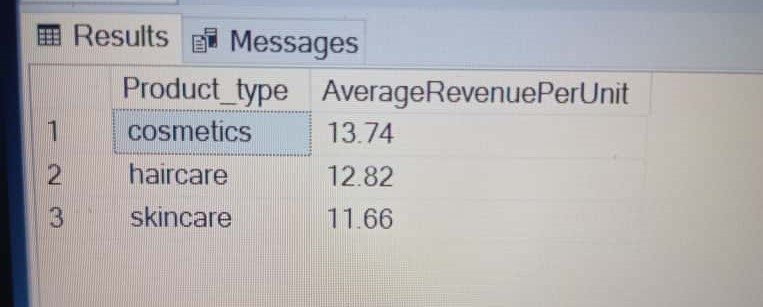
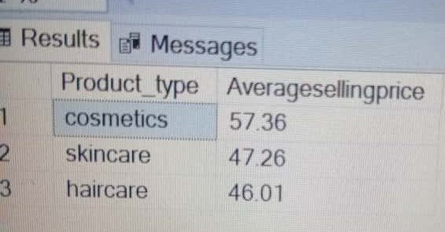
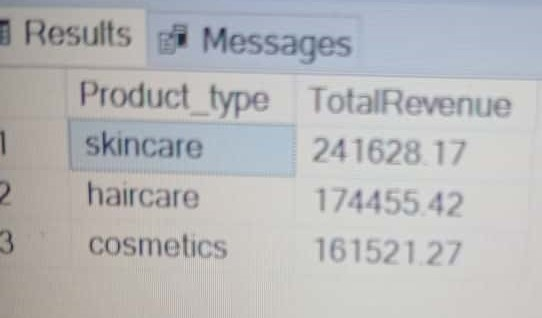
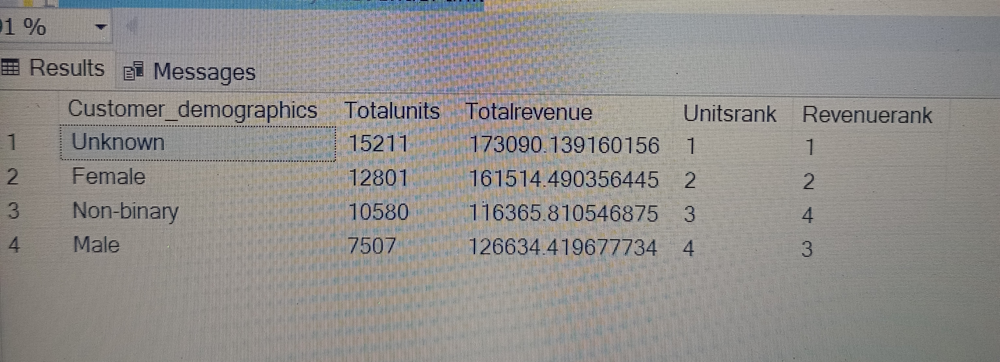
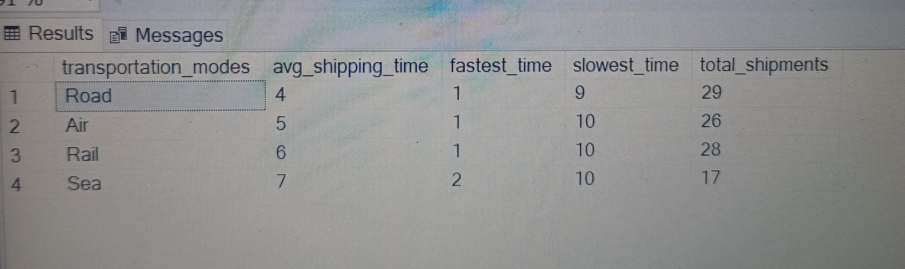
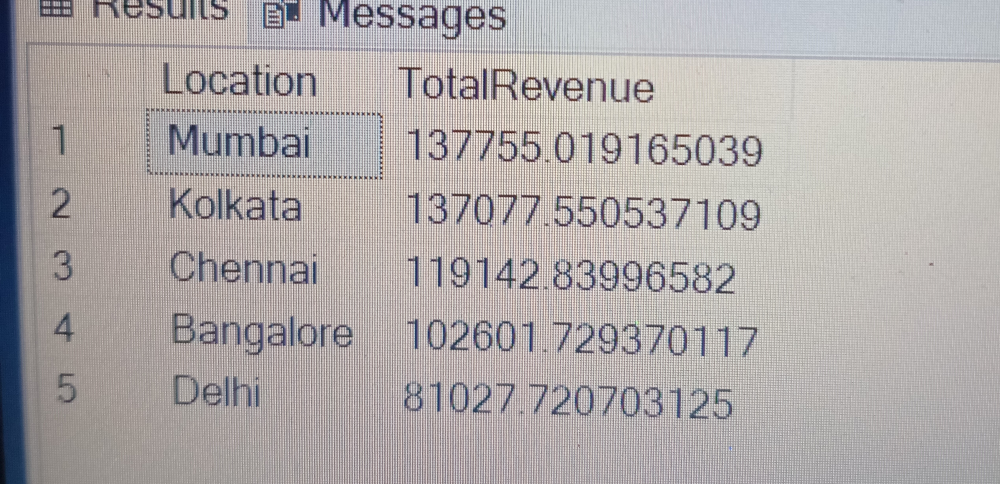
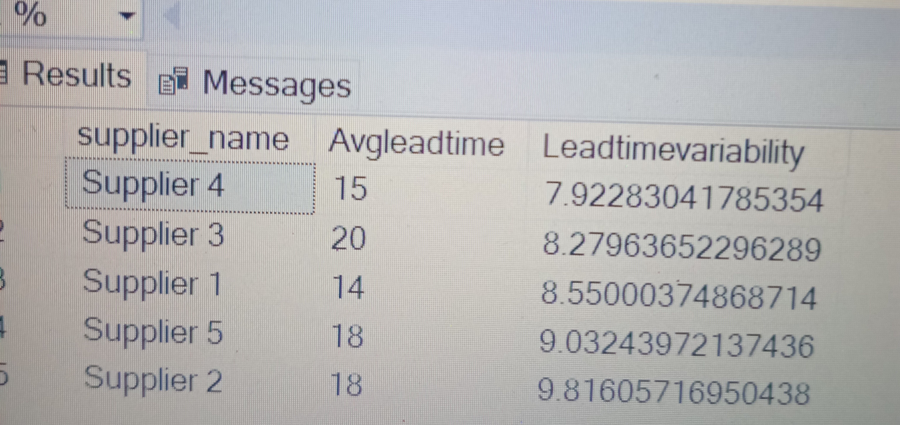

# Supply-chain-analysis
This project showcases a comprehensive supply chain analysis using SQL, designed to provide actionable insights for a beauty and cosmetics startup. The analysis covers key areas such as sales performance, inventory optimization, supplier performance, shipping efficiency, and customer insights.
# Objective
The primary goal of this project is to conduct an extensive analysis of supply chain data, focusing on extracting key insights and identifying opportunities for improvement. Although this initiative is primarily for practice purposes, it aims to explore various components of the supply chain, ranging from operational efficiency to cost management. The objective is to develop a deeper understanding of these processes and propose potential strategic improvements.
This analysis utilises a dataset sourced from Kaggle, kindly provided by Amir Motefaker, available here: https://www.kaggle.com/datasets/amirmotefaker/supply-chain-dataset.
# Project Context & Scope: 
This analysis was developed as a hands-on learning project to demonstrate technical SQL proficiency. While the data variables may reflect a high level of complexity, the conclusions are based strictly on the data provided and the defined scope of this EDA. My focus is on the rigor of the analysis and the practical application of advanced SQL techniques, rather than providing definitive strategic advice on professional supply chain management.
# Data Collection and Analysis Steps
## Data Import and Preliminary Inspection:
* Import the supply chain dataset in CSV format and perform an initial review to understand its structure and content.
# Data Cleaning and Validation:
* Missing Values Assessment: Identify and remediate missing data in key fields like Price, Availability, and Number of Products Sold.
* Data Type Confirmation: Verify that each column is classified with the appropriate data type (numeric, text, etc.).
* SKU Integrity Check: Confirm that SKU identifiers are unique and correctly aligned with their respective Product Types.
# Products and sales performance analysis
* Trend Analysis by Product Type:
** Investigate patterns key areas such as Total Revenue, Average Revenue, Average Selling Price, and Average Lead Times (time from order placement to fulfillment).
* Customer Segmentation and Sales Analysis:
** Demographic Profiling: Analyse customer demographics to better understand the consumer base for each product type.
# Supply Chain Analysis
* Supply Chain Performance Evaluation:
** Lead Time Scrutiny: Examine both Lead Times and Shipping Lead Time for potential delays.
** Supplier Assessment: Evaluate suppliers based on Lead Times, Defect Rates, and Inspection Outcomes.
# Cost Management Analysis:
* Profitability Review: Contrast Costs with Revenue to assess overall profitability.
* Expense Analysis: Scrutinise Shipping and Manufacturing Costs to identify reduction opportunities.
# Logistics Optimisation Study:
* Shipping Method Review: Evaluate Shipping Duration, Carriers, and Modes for logistical improvements.
* Route Optimisation: Analyse transportation routes for efficiency gains.
# Key questions answered:
* What is the average revenue per unit?
* What is the average selling price per product type?
* What products have high manufacturing costs?
* What product type generates the most revenue?
* What are the top selling SKUs according to revenue and quantity?
* Are cheaper products selling more? Are expensive ones performing poorly?
* What Supplier has consistent lead times?
* Shipping carriers that deliver the fastest.
* Identifying unreliable suppliers.
* Consumer demographic that purchase the most products.
* Location that generates the most revenue.
* Faster transportation modes.
* Find the routes that are slow or costly.
## What is the average revenue per unit?

## What is the average selling price per product type?

## What product type generates the most revenue?

## Consumer demographic that purchase the most products.

## Faster transportation modes.

## Location that generates the most revenue.

## What Supplier has consistent lead times?

## Find the routes that are slow or costly.

## What are the top selling SKUs according to revenue and quantity?
